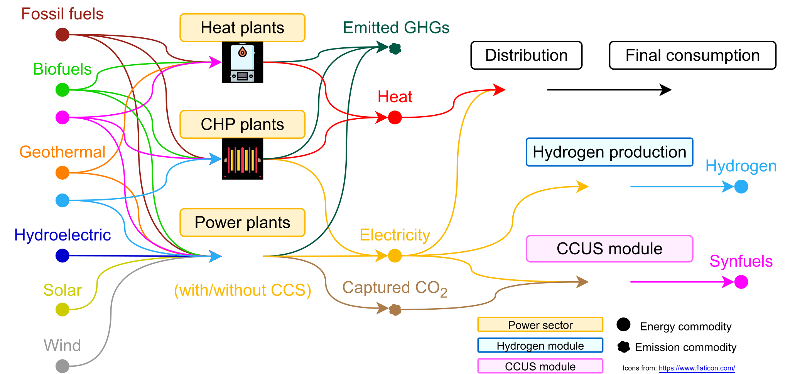

# TEMOA-Italy
## Model features

TEMOA-Italy is a model instance for the optimization of the Italian energy system developed within an [extended version](https://github.com/MAHTEP/TEMOA) of the [TEMOA](https://temoacloud.com/) (Tools for Energy Modeling Optimization and Analysis) modeling framework.

The model is maintained by the [MAHTEP Group](http://www.mahtep.polito.it) at [Department of Energy](https://www.denerg.polito.it/en/) of [Politecnico di Torino](https://www.polito.it/en). For any inquiries concerning TEMOA-Italy, please contact [Matteo Nicoli](mailto:matteo.nicoli@polito.it).

The TEMOA-Italy database was generated starting from the TIMES-Italy model, developed by ENEA in the [TIMES](https://iea-etsap.org/index.php/etsap-tools/model-generators/times) modeling framework. Compared to the original TIMES-Italy 2010 version [1], the current TEMOA-Italy is updated, integrated, and recalibrated to historical data up to 2020.

A detailed description of the methodology adopted for TEMOA-Italy construction is available at [2] and [3], while a schematic representation of the reference energy system (RES) is shown in Figure 1.

*Figure 1. Representation of the TEMOA-Italy energy system [4].*

As Figure 1 highlights, the TEMOA-Italy RES is composed of several energy sectors. The supply side includes the upstream sector (producing and transforming fossil fuels, biofuels and renewable potentials and modeling import/export), the power sector (devoted to the production of electricity and heat, see Figure 2), the hydrogen module (including hydrogen production, distribution, and storage technologies, see Figure 3) and the Carbon Capture Utilization and Storage (CCUS) module (modeling CO2 capture, utilization – through synfuels production – and storage, see Figure 4).

*Figure 2. The TEMOA-Italy power sector [5].*

Energy imports/exports are modelled in TEMOA-Italy with a single technology per each imported/exported commodity, representing the average import/export price according to World Bank historical data [6] and the World Energy Outlook 2022 future projections [7]. Constraints for imported and exported commodities are from Eurostat [8] for the historical period 2006-2020 and progressively relaxed for future years. The demand projection for future years is presented in [9]. The set of hurdle rates is from [10].

TEMOA-Italy also includes technologies for hydrogen production (grey, blue, green, and yellow hydrogen, as reported in [11]), final consumption (transport, industry and blending with natural gas) or transformation processes involving hydrogen. Indeed, the CCUS modules also includes synfuels production options (syndiesel, synkerosene, synmethanol, and synmethane) and technologies for CO2 capture and storage (as discussed in [4] and [12]). Hydrogen and synfuels represents, along with biofuels, low-carbon fuels that can be consumed mixed with traditional fossil fuels: in this regard, a dynamic emission accounting was developed as described in [4] and [12].

*Figure 3. The TEMOA-Italy hydrogen module [4].*

*Figure 4. The TEMOA-Italy CCUS module [4].*

The demand side covers the buildings sector (which includes residential, commercial and agriculture end-uses), several road and non-road transport demands (based on [13] and [14]), and the energy intensive industrial subsectors (based on [14] and [15]).

## References

1. ENEA, “The TIMES-Italy Energy Model Structure and Data 2010 Version,” Rome, 2011. Accessed: Sep. 02, 2022. [Online]. Available: https://biblioteca.bologna.enea.it/RT/2011/2011_9_ENEA.pdf
2. M. Nicoli, F. Gracceva, D. Lerede, and L. Savoldi, “Can We Rely on Open-Source Energy System Optimization Models? The TEMOA-Italy Case Study,” Energies (Basel), vol. 15, no. 18, p. 6505, Sep. 2022, doi: 10.3390/en15186505.
3. M. Nicoli, A TIMES-like open-source model for the Italian energy system. Turin, 2021. Accessed: Jul. 05, 2022. [Online]. Available: https://webthesis.biblio.polito.it/18850/
4. G. Colucci, D. Lerede, M. Nicoli, and L. Savoldi, “A dynamic accounting method for CO2 emissions to assess the penetration of low-carbon fuels: application to the TEMOA-Italy energy system optimization model,” Appl Energy, vol. 352, no. 121951, Dec. 2023, doi: 10.1016/j.apenergy.2023.121951.
5. D. Mosso, G. Colucci, D. Lerede, M. Nicoli, M. S. Piscitelli, and L. Savoldi, “How much do carbon emission reduction strategies comply with a sustainable development of the power sector?,” Energy Reports, vol. 11, pp. 3064–3087, Jun. 2024, doi: 10.1016/J.EGYR.2024.02.056.
6. World Bank, “Commodity Markets.” Accessed: Jul. 19, 2023. [Online]. Available: https://www.worldbank.org/en/research/commodity-markets
7. International Energy Agency (IEA), “World Energy Outlook 2022,” 2022. Accessed: Dec. 21, 2022. [Online]. Available: www.iea.org/t&c/
8. Eurostat, “Energy balances - Energy - Eurostat.” Accessed: Aug. 19, 2022. [Online]. Available: https://ec.europa.eu/eurostat/web/energy/data/energy-balances
9. A. Oliva, F. Gracceva, D. Lerede, M. Nicoli, and L. Savoldi, “Projection of Post-Pandemic Italian Industrial Production through Vector AutoRegressive Models,” Energies 2021, Vol. 14, Page 5458, vol. 14, no. 17, p. 5458, Sep. 2021, doi: 10.3390/EN14175458.
10. S. Laera, G. Colucci, V. Di Cosmo, D. Lerede, M. Nicoli, and L. Savoldi, “Technology-specific hurdle rates for Energy System Optimization Models,” in Energy Proceedings, 2024. doi: 10.46855/energy-proceedings-10911.
11. A. Balbo, G. Colucci, M. Nicoli, and L. Savoldi, “Exploring the Role of Hydrogen to Achieve the Italian Decarbonization Targets Using an Open-Source Energy System Optimization Model,” in International Journal of Energy and Power Engineering, E. and T. World Academy of Science, Ed., Mar. 2023, pp. 89–100. Accessed: Apr. 24, 2023. [Online]. Available: https://publications.waset.org/10013040/exploring-the-role-of-hydrogen-to-achieve-the-italian-decarbonization-targets-using-an-open-source-energy-system-optimization-model
12. G. Colucci, D. Lerede, M. Nicoli, and L. Savoldi, “Dynamic Accounting for End-Use CO2 Emissions From Low-Carbon Fuels in Energy System Optimization Models,” Energy Proceedings, 2022, doi: 10.46855/energy-proceedings-10294.
13. D. Lerede, C. Bustreo, F. Gracceva, Y. Lechón, and L. Savoldi, “Analysis of the Effects of Electrification of the Road Transport Sector on the Possible Penetration of Nuclear Fusion in the Long-Term European Energy Mix,” Energies (Basel), vol. 13, no. 14, p. 3634, Jul. 2020, doi: 10.3390/EN13143634.
14. Y. Lechon et al., “A global energy model with fusion,” Fusion Engineering and Design, vol. 75, pp. 1141–1144, 2005, doi: 10.1016/j.fusengdes.2005.06.078.
15. D. Lerede, M. Saccone, C. Bustreo, F. Gracceva, and L. Savoldi, “Could clean industrial progresses and the rise of electricity demand foster the penetration of nuclear fusion in the European energy mix?,” Fusion Engineering and Design, vol. 172, p. 112880, Nov. 2021, doi: 10.1016/J.FUSENGDES.2021.112880.

## Contribution

The developing team wishes to receive help form the users in the definition and test of new test cases, in the benchmark against other established software, in the inclusion of other functionalities.
To contribute please refer to [contribution](CONTRIBUTION.md).

## Code of Conduct

The developing team agreed to embrace the  **Code of Conduct**.
 
## License
TEMOA-Italy is licensed under  or any other version of it.
