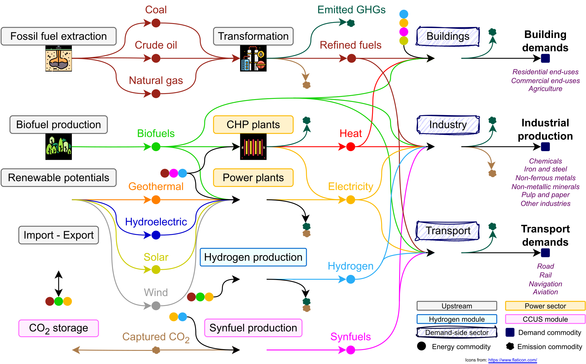
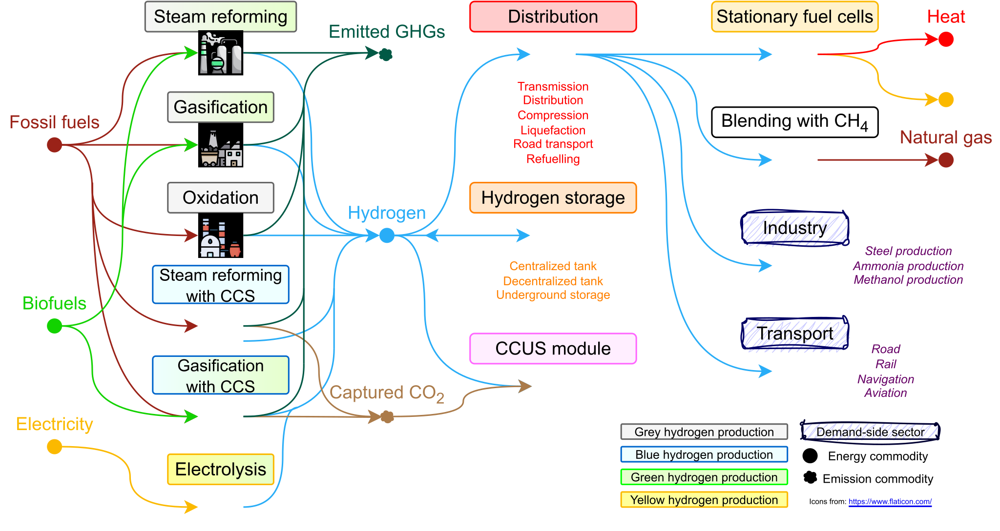
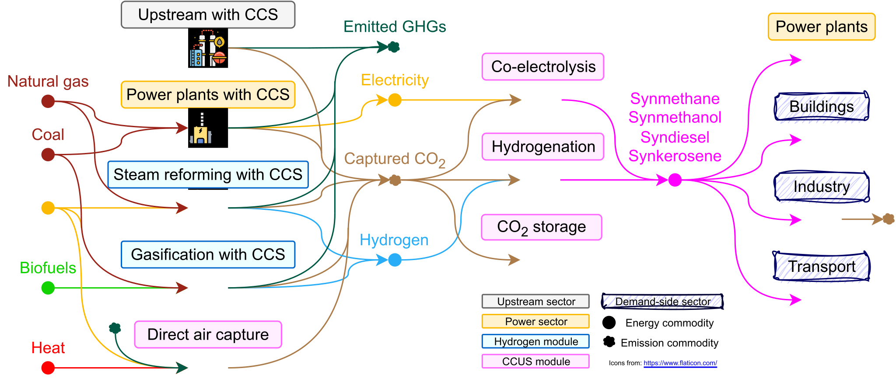

# TEMOA-Italy
## Model features

TEMOA-Italy is a model instance for the optimization of the Italian energy system developed within an [extended version](https://github.com/MAHTEP/TEMOA) of the [TEMOA](https://temoacloud.com/) (Tools for Energy Modeling Optimization and Analysis) modeling framework.

The maintenance team currently includes [Matteo Nicoli](http://www.mahtep.polito.it/people/phd_students/nicoli_matteo), [Gianvito Colucci](http://www.mahtep.polito.it/people/phd_students/colucci_gianvito), [Daniele Lerede](http://www.mahtep.polito.it/people/phd_students/lerede_daniele) and Prof. [Laura Savoldi](http://www.mahtep.polito.it/people/head/savoldi_laura) from [MAHTEP Group](http://www.mahtep.polito.it) at [Department of Energy](https://www.denerg.polito.it/en/) of [Politecnico di Torino](https://www.polito.it/en).
For any communication related to TEMOA-Italy, please write to [matteo.nicoli@polito.it and gianvito.colucci@polito.it](mailto:matteo.nicoli@polito.it;gianvito.colucci@polito.it).

The TEMOA-Italy database was generated starting from the TIMES-Italy model, developed by ENEA in the [TIMES](https://iea-etsap.org/index.php/etsap-tools/model-generators/times) modeling framework. The current TEMOA-Italy is updated, integrated, and recalibrated to historical data up to 2020 with respect to the original TIMES-Italy 2010 version [1].

A schematic representation of the reference energy system (RES) is shown in Figure 1.

*Figure 1. Representation of the TEMOA-Italy energy ystem [2].*

As Figure 1 highlights, the TEMOA-Italy RES is composed of several energy sectors.
The supply side includes the upstream sector (producing and transforming fossil fuels, biofuels and renewable potentials and modeling import/export), the power sector (devoted to the production of electricity and heat), the hydrogen module (including hydrogen production, distribution, and storage technologies, see Figure 2) and the Carbon Capture Utilization and Storage (CCUS) module (modeling CO2 capture, utilization – through synfuels production – and storage, see Figure 3).
The demand side covers the building sector (which includes residential, commercial and agriculture end-uses), several road and non-road transport demands, and the energy intensive industrial subsectors.

Figure 2. The TEMOA-Italy hydrogen module [2].

Figure 3. The TEMOA-Italy CCUS module [2].

A detailed description of the methodology adopted for TEMOA-Italy construction, together with a detailed assessment of its reliability in reproducing equivalent results with respect to its counterpart TIMES-Italy, is available at [3] and [4].

Here follows a summary of the main changes from the original TIMES-Italy 2010 version to the current TEMOA-Italy:
- Transport sector: recalibration of base year modeling and update of new technologies characterization, based on [5] and [6].
- Industry: recalibration of base year modeling and update of new technologies characterization, based on [6] and [7].
- Hydrogen sector: integration of a new hydrogen technology module, as discussed in [2] and [8].
- CCUS sector: integration of a new CCUS (carbon capture utilization and storage) technology module, as discussed in [2] and [8].
- Emissions: integration of a dynamic emission accounting of CO2 emissions, as discussed in [2] and [9].
- Demand projection: update of socio-economic drivers and elasticities for demands projection, based on [10], [11] and [12].

## References

1. ENEA, “The TIMES-Italy Energy Model Structure and Data 2010 Version,” Rome, 2011. Accessed: Sep. 02, 2022. [Online]. Available: https://biblioteca.bologna.enea.it/RT/2011/2011_9_ENEA.pdf
2. G. Colucci, D. Lerede, M. Nicoli, and L. Savoldi, “A dynamic accounting method for CO2 emissions to assess the penetration of low-carbon fuels: application to the TEMOA-Italy energy system optimization model,” Appl Energy, vol. 352, no. 121951, Dec. 2023, doi: 10.1016/j.apenergy.2023.121951.
3. M. Nicoli, F. Gracceva, D. Lerede, and L. Savoldi, “Can We Rely on Open-Source Energy System Optimization Models? The TEMOA-Italy Case Study,” Energies (Basel), vol. 15, no. 18, p. 6505, Sep. 2022, doi: 10.3390/en15186505.
4. M. Nicoli, A TIMES-like open-source model for the Italian energy system. Turin, 2021. Accessed: Jul. 05, 2022. [Online]. Available: https://webthesis.biblio.polito.it/18850/
5. D. Lerede, C. Bustreo, F. Gracceva, Y. Lechón, and L. Savoldi, “Analysis of the Effects of Electrification of the Road Transport Sector on the Possible Penetration of Nuclear Fusion in the Long-Term European Energy Mix,” Energies (Basel), vol. 13, no. 14, p. 3634, Jul. 2020, doi: 10.3390/EN13143634.
6. Y. Lechon et al., “A global energy model with fusion,” Fusion Engineering and Design, vol. 75, pp. 1141–1144, 2005, doi: 10.1016/j.fusengdes.2005.06.078.
7. D. Lerede, M. Saccone, C. Bustreo, F. Gracceva, and L. Savoldi, “Could clean industrial progresses and the rise of electricity demand foster the penetration of nuclear fusion in the European energy mix?,” Fusion Engineering and Design, vol. 172, p. 112880, Nov. 2021, doi: 10.1016/J.FUSENGDES.2021.112880.
8. A. Balbo, G. Colucci, M. Nicoli, and L. Savoldi, “Exploring the Role of Hydrogen to Achieve the Italian Decarbonization Targets Using an Open-Source Energy System Optimization Model,” in International Journal of Energy and Power Engineering, E. and T. World Academy of Science, Ed., Mar. 2023, pp. 89–100. Accessed: Apr. 24, 2023. [Online]. Available: https://publications.waset.org/10013040/exploring-the-role-of-hydrogen-to-achieve-the-italian-decarbonization-targets-using-an-open-source-energy-system-optimization-model
9. G. Colucci, D. Lerede, M. Nicoli, and L. Savoldi, “Dynamic Accounting for End-Use CO2 Emissions From Low-Carbon Fuels in Energy System Optimization Models,” Energy Proceedings, 2022, doi: 10.46855/energy-proceedings-10294.
10. A. Oliva, F. Gracceva, D. Lerede, M. Nicoli, and L. Savoldi, “Projection of Post-Pandemic Italian Industrial Production through Vector AutoRegressive Models,” Energies 2021, Vol. 14, Page 5458, vol. 14, no. 17, p. 5458, Sep. 2021, doi: 10.3390/EN14175458.
11. European Commission. Joint Research Centre., “POTEnCIA.” https://joint-research-centre.ec.europa.eu/potencia_en (accessed Feb. 10, 2023).
12. European Commission. Joint Research Centre., “PRIMES Energy System Model.” https://web.jrc.ec.europa.eu/policy-model-inventory/explore/models/model-primes (accessed Feb. 10, 2023).

## Contribution

The developing team wishes to receive help form the users in the definition and test of new test cases, in the benchmark against other established software, in the inclusion of other functionalities.
To contribute please refer to [contribution](CONTRIBUTION.md).

## Code of Conduct

The developing team agreed to embrace the  **Code of Conduct**.
 
## License
TEMOA-Italy is licensed under  or any other version of it.
