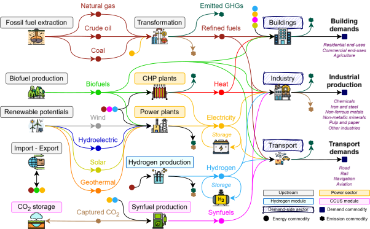
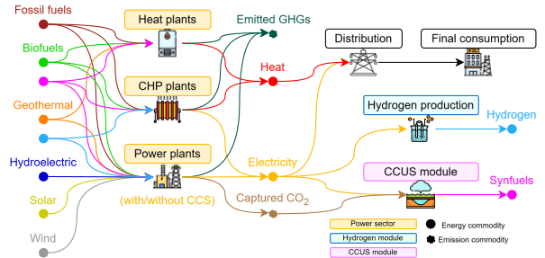
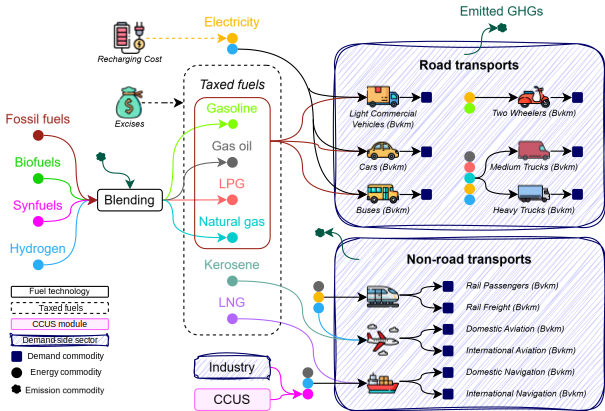

# **TEMOA-Italy**
TEMOA-Italy is a model instance for the optimization of the Italian energy system developed within an [extended version](https://github.com/MAHTEP/TEMOA) of the [TEMOA](https://temoacloud.com/) (Tools for Energy Modeling Optimization and Analysis) modeling framework.

The model is maintained by the [MAHTEP Group](http://www.mahtep.polito.it/) at [Department of Energy](https://www.denerg.polito.it/en/) of [Politecnico di Torino](https://www.polito.it/en). For any inquiries concerning TEMOA-Italy, please contact [Matteo Nicoli](mailto:matteo.nicoli@polito.it).

The model adopts a time horizon extending up to 2050, with energy system evolution analyzed in five-year increments. It is built upon historical energy statistics from the International Energy Agency (IEA) for the base year 2006 and calibrated up to 2022 using Eurostat Energy Balances. The model can optimize a reduced set of time periods when solving particularly complex problems to manage computational requirements [1].

## **Model Structure and Scope**
The overall structure of TEMOA-Italy is depicted in Figure 1.

Figure 1. Representation of the TEMOA-Italy energy system.

It shows the linear energy flows across different sectors, from upstream production to final consumption. The model employs a Reference Energy System (RES) framework, describing the interactions among energy carriers, technologies, and end-uses in a transparent and flexible manner.

The energy system is divided into supply-side and demand-side components. The upstream supply sector comprises primary energy production, transformation processes, and international trade. Fossil fuel extraction is limited by proved, probable, and possible reserves, while renewable potentials are constrained by resource availability. Imports and exports are represented through trade processes associated with cost assumptions.

The demand side is split into three primary sectors: buildings, industry, and transport. Each of these sectors includes multiple subsectors to capture the diversity of energy consumption patterns:

- Buildings: End-uses include space heating, space cooling, water heating, lighting, and appliances [2].
- Industry: Energy-intensive subsectors such as chemicals, iron and steel, non-ferrous metals, non-metallic minerals, and pulp and paper are explicitly represented.
- Transport: Passenger and freight transport demands are modeled across multiple modes, including road, rail, aviation, and navigation, as illustrated in Figure 3 [3].

## **Supply-Side Modeling**
The upstream sector, shown schematically in Figure 3, includes fossil and renewable energy production, fuel transformation, and cross-border energy trade. Fossil fuel extraction covers coal, oil, and natural gas, with constraints reflecting available reserves. Biofuel production includes solid biomass, bioethanol, biodiesel, and biogas, with options for biomethane upgrading [4]. Secondary production processes like natural gas liquefaction and gasification are also incorporated. Renewable energy generation potentials, including solar, wind, hydro, biomass, and geothermal, are based on external assessments.

Electricity imports and exports are modeled as virtual processes with cost-driven constraints, while domestic electricity generation is detailed in Figure 2.

Figure 2. Representation of the TEMOA-Italy power sector.

The power sector includes various generation technologies, combined heat and power (CHP) plants, and heat-only plants. Capacity factors, capacity credits for variable renewable sources, and combined heat-to-power ratios for CHP plants are specified to represent operational characteristics accurately [5].
## **Demand-Side Dynamics**
Energy service demands evolve over time based on sector-specific drivers and elasticities, projected through a demand function incorporating historical trends and future assumptions [6]. For instance, the transport sector (depicted in Figure 3) encompasses road, rail, aviation, and navigation modes, each disaggregated by passenger and freight services. The model aligns with Eurostat classification, distinguishing energy used for transport operations from non-energy uses like lubricants.

Figure 3. Representation of the TEMOA-Italy transport sector.

## **Model Applications and Recent Developments**
TEMOA-Italy has been employed to analyze various aspects of the Italian energy transition, including industrial sector projections [6], the role of discount rates in investment decisions [3], and energy storage dynamics [5]. The model has also supported studies on the compatibility of energy policies with sustainable development goals [7], investigation of sustainability metrics [8] and the impact of critical raw material availability on energy system security [9], [10].

## **References**
1. M. Nicoli, F. Gracceva, D. Lerede, and L. Savoldi, “Can We Rely on Open-Source Energy System Optimization Models? The TEMOA-Italy Case Study,” *Energies (Basel)*, vol. 15, no. 18, p. 6505, Sep. 2022, doi: 10.3390/en15186505.
2. M. Nicoli, “A TIMES-like open-source model for the Italian energy system,” Politecnico di Torino, Turin, 2021. Accessed: Jul. 05, 2022. [Online]. Available: https://webthesis.biblio.polito.it/18850/
3. M. Nicoli, G. Colucci, V. Di Cosmo, D. Lerede, and L. Savoldi, “Evaluating the impact of hurdle rates on the Italian energy transition through TEMOA,” *Appl Energy*, vol. 377PC, no. 124633, 2024, doi: 10.1016/j.apenergy.2024.124633.
4. G. Colucci, D. Lerede, M. Nicoli, and L. Savoldi, “A dynamic accounting method for CO2 emissions to assess the penetration of low-carbon fuels: application to the TEMOA-Italy energy system optimization model,” *Appl Energy*, vol. 352, no. 121951, Dec. 2023, doi: 10.1016/j.apenergy.2023.121951.
5. M. Nicoli, V. A. D. Faria, A. R. de Queiroz, and L. Savoldi, “Modeling energy storage in long-term capacity expansion energy planning: an analysis of the Italian system,” *J Energy Storage*, vol. 101PA, no. 113814, 2024, doi: 10.1016/j.est.2024.113814.
6. A. Oliva, F. Gracceva, D. Lerede, M. Nicoli, and L. Savoldi, “Projection of Post-Pandemic Italian Industrial Production through Vector AutoRegressive Models,” *Energies 2021, Vol. 14, Page 5458*, vol. 14, no. 17, p. 5458, Sep. 2021, doi: 10.3390/EN14175458.
7. M. Nicoli *et al.*, “Enabling Coherence Between Energy Policies and SDGs Through Open Energy Models: The TEMOA-Italy Example,” in *Aligning the Energy Transition with the Sustainable Development Goals: Key Insights from Energy System Modelling*, M. Labriet, K. Espegren, G. Giannakidis, and B. O’Gallachoir, Eds., Springer, 2024, pp. 97–118. doi: 10.1007/978-3-031-58897-6\_5.
8. D. Mosso, G. Colucci, D. Lerede, M. Nicoli, M. S. Piscitelli, and L. Savoldi, “How much do carbon emission reduction strategies comply with a sustainable development of the power sector?,” *Energy Reports*, vol. 11, pp. 3064–3087, Jun. 2024, doi: 10.1016/J.EGYR.2024.02.056.
9. A. Vai, G. Colucci, M. Nicoli, and L. Savoldi, “A Comprehensive Metric to Assess the Security of Future Energy Systems Through Energy System Optimization Models,” *Energy Proceedings*, vol. 47, 2024, doi: 10.46855/energy-proceedings-11292.
10. A. Vai, G. Colucci, M. Nicoli, and L. Savoldi, “May the availability of critical raw materials affect the security of energy systems? An analysis for risk-aware energy planning with TEMOA-Italy,” *Mater Today Energy*, vol. 48, no. 101805, 2025, doi: 10.1016/j.mtener.2025.101805.

## **Contribution**

The developing team wishes to receive help form the users in the definition and test of new test cases, in the benchmark against other established software, in the inclusion of other functionalities.
To contribute please refer to [contribution](CONTRIBUTION.md).

## **Code of Conduct**

The developing team agreed to embrace the  **Code of Conduct**.
 
## **License**
TEMOA-Italy is licensed under  or any other version of it.
